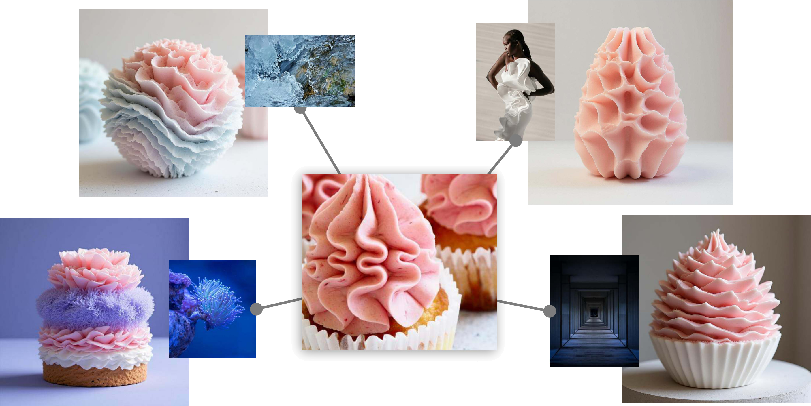
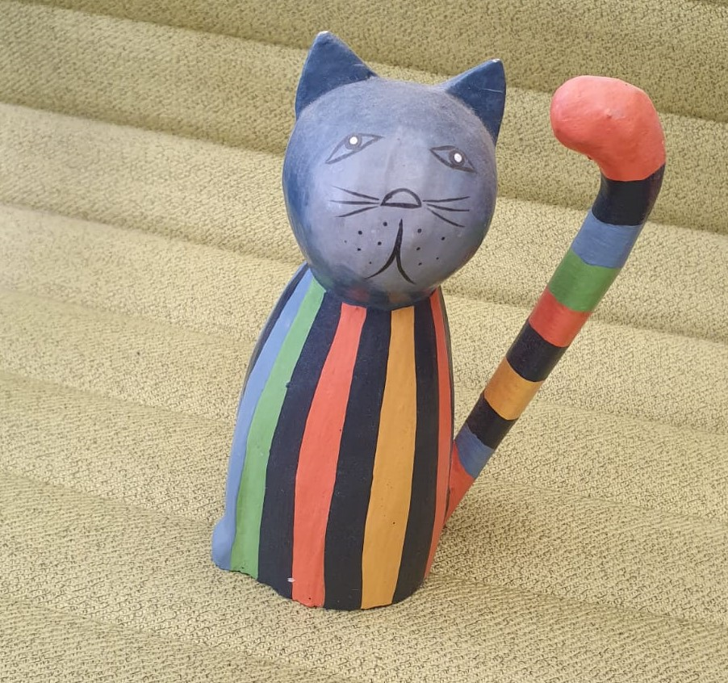

# Inspiration Seeds: Learning Non-Literal Visual Combinations for Generative Exploration

<!-- TODO: Add arXiv badge once submitted -->
<!-- [](https://arxiv.org/abs/XXXX.XXXXX) -->

<!-- TODO: Add project page link -->
<!-- [Project Page](https://project-page-url/) -->

<p align="center">

</p>

## Abstract

While generative models have become powerful tools for image synthesis, they are typically optimized for executing carefully crafted textual prompts, offering limited support for the open-ended visual exploration that often precedes idea formation. In contrast, designers frequently draw inspiration from loosely connected visual references, seeking emergent connections that spark new ideas. We propose **Inspiration Seeds**, a generative framework that shifts image generation from final execution to exploratory ideation. Given two input images, our model produces diverse, visually coherent compositions that reveal latent relationships between inputs, without relying on user-specified text prompts. Our approach is feed-forward, trained on synthetic triplets of decomposed visual aspects derived entirely through visual means: we use CLIP Sparse Autoencoders to extract editing directions in CLIP latent space and isolate concept pairs. By removing the reliance on language and enabling fast, intuitive recombination, our method supports visual ideation at the early and ambiguous stages of creative work.

## Usage

### Image Combination (`generate.py`)

Combines two input images into a single object inspired by both, using FLUX Kontext. The model creates non-trivial visual combinations without requiring text prompts.

**Basic usage:**
```bash
uv run generate.py \
    --image1 assets/example_generation_inputs/arch1.jpeg \
    --image2 assets/example_generation_inputs/food1.jpeg \
    --output-dir outputs/
```

**Options:**
| Argument | Default | Description |
|----------|---------|-------------|
| `--image1` | (required) | Path to the first input image (top-left in grid) |
| `--image2` | (required) | Path to the second input image (bottom-right in grid) |
| `--output-dir` | `outputs/` | Directory for output images |
| `--guidance-scale` | `4.0` | Higher values = stronger guidance |
| `--lora-path` | None | Optional LoRA checkpoint (local path, HuggingFace repo, or URL) |
| `--seed` | `1` | Base random seed |
| `--num-seeds` | `4` | Number of variations to generate |

**Example with custom settings:**
```bash
uv run generate.py \
    --image1 path/to/first.jpg \
    --image2 path/to/second.jpg \
    --output-dir my_outputs/ \
    --num-seeds 8 \
    --guidance-scale 5.0
```

### Image Decomposition (`decompose.py`)

Decomposes an image into its visual concepts using CLIP Sparse Autoencoders, then generates variations by moving along the discovered concept directions. This reveals the underlying visual components of an image.

**Basic usage:**
```bash
uv run decompose.py \
    --image assets/example_decomposition_inputs/cat1.jpeg \
    --output-dir outputs/
```

**Options:**
| Argument | Default | Description |
|----------|---------|-------------|
| `--image` | (required) | Path to the input image |
| `--output-dir` | `outputs/` | Directory for output images |
| `--top-k` | `32,64` | Comma-separated list of top-k SAE features to use |
| `--clean-clusters-frac` | `0.5,0.7` | Comma-separated cluster cleaning fractions |

**Example with custom parameters:**
```bash
uv run decompose.py \
    --image my_image.jpg \
    --output-dir decomposition_results/ \
    --top-k 32,48,64 \
    --clean-clusters-frac 0.3,0.5,0.7
```

The script generates images at different "step sizes" along the discovered concept direction, showing how the image transforms when moving toward or away from each cluster.

## Example Results

### Image Combination
Given two input images, the model generates diverse combinations:

| Input 1 | Input 2 | Outputs |
|---------|---------|---------|
|  |  | Multiple creative combinations |

### Image Decomposition
Given a single image, the model discovers and visualizes its underlying concepts:

| Input | Decomposition outputs at different steps |
|-------|------------------------------------------|
|  | Variations along concept directions |

## License

This project is licensed under the MIT License - see the [LICENSE](LICENSE) file for details.
